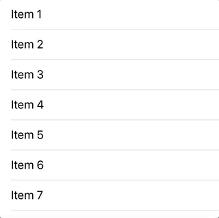

# SwiftReorder

SwiftReorder is a UITableView extension that lets you easily add drag-and-drop reordering to any table view. It's robust, lightweight, and completely customizable.



## Features

- [x] Smooth animations
- [x] Automatic edge scrolling
- [x] Supports dynamically sized cells
- [x] Works with multiple table sections
- [x] Customizable shadow, scaling, and transparency effects

## Installation

### CocoaPods

To integrate SwiftReorder into your Xcode project using CocoaPods, specify it in your `Podfile`:

```ruby
pod 'SwiftReorder', '~> 2.0'
```

### Manually

You can integrate SwiftReorder into your project manually by copying the contents of the `Source` folder into your project.

## Usage

### Setup

* Add the following line to your table view setup.
```swift
tableView.reorder.delegate = self
```
* Add this code to the beginning of your `tableView(_:cellForRowAt:)`.
```swift
if let spacer = tableView.reorder.spacerCell(for: indexPath) {
    return spacer
}
```
* Implement this `TableViewReorderDelegate` method, and others as necessary.
```swift
tableView(_:reorderRowAt:to:)
```

### Customization
SwiftReorder exposes several properties for adjusting the style of the reordering effect. For example, you can add a scaling effect to the selected cell:
```swift
tableView.reorder.cellScale = 1.05
```
Or adjust the shadow:
```swift
tableView.reorder.shadowOpacity = 0.5
tableView.reorder.shadowRadius = 20
```
